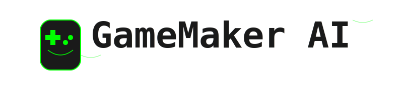

# GameMaker AI Agent 🎮

<div align="center">
  
</div>

A local-first game development environment powered by AI collaboration. Watch as two AI agents work together to create, refine, and evolve games based on your descriptions.


## ✨ Features

- **100% Local & Private**: All code generation runs on your machine using Ollama
- **Continuous Evolution**: AIs keep improving the code indefinitely
- **Auto-Versioning**: Download any version at any time
- **Real-time Development**: Watch the AIs collaborate live
- **No Setup Required**: Just describe your game and watch it come to life

## 🚀 Quick Setup

1. **Install Ollama**
```bash
# From ollama.ai
curl https://ollama.ai/install.sh | sh
```

2. **Pull the Model**
```bash
ollama pull qwen:14b
```

3. **Clone & Setup**
```bash
git clone https://github.com/Shivp1413/gamemaker-ai-agent
cd gamemaker-ai-agent
python -m venv venv
source venv/bin/activate  # On Windows: venv\Scripts\activate
pip install -r requirements.txt
```

4. **Run**
```bash
streamlit run app.py
```

5. Open your browser to `http://localhost:8501`

## 🎯 Usage

1. Enter your game description
2. Click "Start Creating Game"
3. Watch the AIs collaborate
4. Download any version you like
5. The AIs will keep improving the code until you stop them

## 🔍 Current Status

This project is under active development. Current limitations include:

- High memory usage over long sessions
- Occasional AI conversation loops
- Limited error recovery
- Basic code quality checks

## 🤝 Want to Help?

We need help with:

1. **Memory Management**
   - Implementing conversation pruning
   - Reducing resource usage

2. **Code Quality**
   - Adding automated tests
   - Implementing code validation
   - Improving error handling

3. **UI/UX**
   - Better version management
   - Progress indicators
   - Code diff viewing

4. **Documentation**
   - Setup guides for different OS
   - Troubleshooting guides
   - API documentation

## 🐛 Common Issues & Fixes

### Ollama Connection Error
```bash
# Check if Ollama is running
ollama list

# Restart Ollama
sudo systemctl restart ollama  # Linux
ollama start  # macOS
```

### High Memory Usage
- Stop and restart the development process
- Clear browser cache
- Restart Streamlit

### AI Gets Stuck
- Click "Stop Development"
- Start a new session
- Try rephrasing your game description

## 📁 Project Structure
```
gamemaker-ai-agent/
├── app.py                   # Main application
├── models/                  # Core classes
├── utils/                   # Helper functions
├── config/                  # Configuration
├── ui/                      # UI components
└── assets/                 # Static files
```

## ⚡ Performance Tips

1. Close other resource-intensive applications
2. Use a machine with at least 16GB RAM
3. Keep game descriptions clear and specific
4. Restart for long development sessions

## 🔄 Version Management

Each version includes:
- Complete game code
- What's new description
- Run instructions
- Download option
- Version history

## 🛟 Need Help?

1. Check the [Issues](https://github.com/Shivp1413/gamemaker-ai-agent/issues) page
2. Read through [Discussions](https://github.com/Shivp1413/gamemaker-ai-agent/discussions)
3. Start a new discussion if you're stuck

## 📈 Future Plans

- [ ] Memory optimization
- [ ] Code validation
- [ ] Multiple game templates
- [ ] Export to different formats
- [ ] Better error recovery
- [ ] Testing framework

## 📝 License

MIT License - see LICENSE file

---

**Note**: This is an experimental project under active development. Results may vary, and the AI agents might occasionally need guidance or restart.